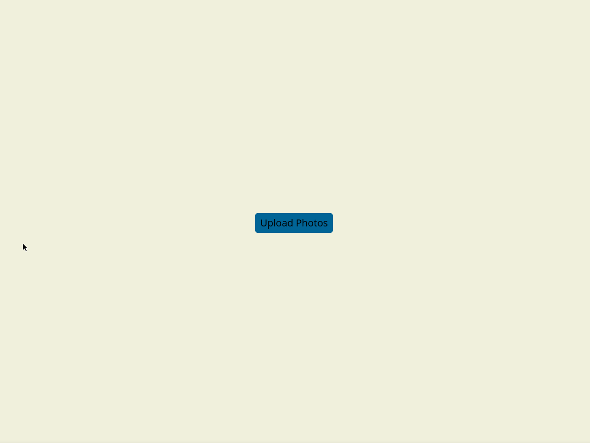
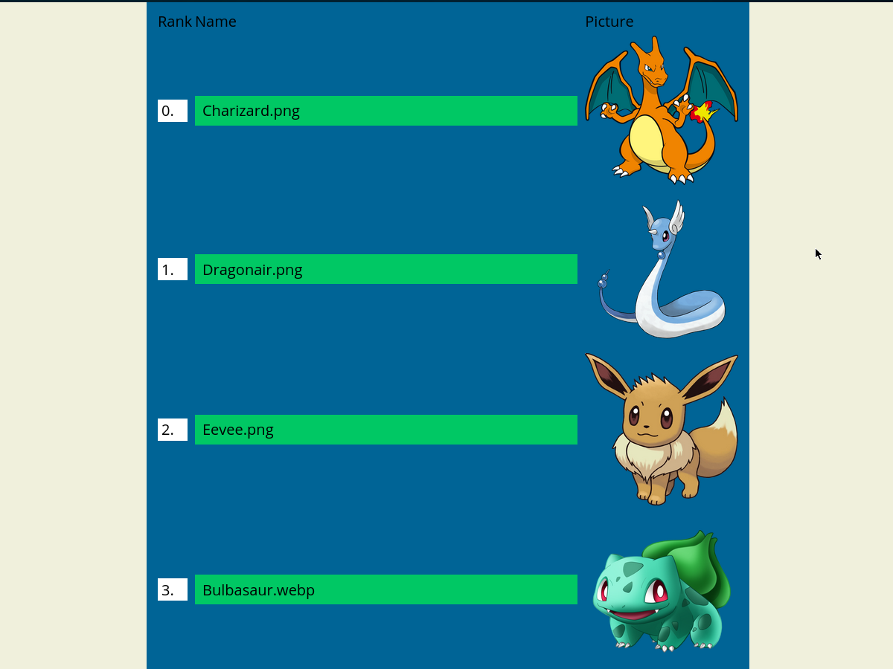

# Step Sorter

Elm Step Sorter is Elm code you can use to sort a list in your web application.

`mergeSort` returns a Result of either the sorted list, or an intermittent step. You can call `choices` on an intermittent step to get a pair of elements that are currently being sorted. You must provide an `Ord` to your calls to mergeSort, ordering that pair, in order to progress sorting.

## Demo
I have made a demo app for showcasing a use case for the algorithm. It is deployed on github-pages [here](https://ampheul.github.io/elm-step-sorter/)

### Step 1: upload pictures

### Step 2: Pick your favorite option

### Step 3: Get an ordered list of your favorites!
